# 第三章 方程组求根

## 3.3 非线性方程组求根

### 3.3.1二分法

```python
# Dichotomy


def Dichotomy(a, b, delta, p):
    i = np.array([a, b])
    while abs(i[0]-i[1]) > delta:
        temp = (i[0]+i[1])/2
        if p(temp)*p(i[0]) > 0:
            i[0] = temp
        else:
            i[1] = temp
        # print(i)
    print("the result of Dichotomy is", i[0])
```

### 3.3.2简单迭代法

```python
# Iterative method


def Iterative(a, b, delta, p, method):
    i = np.array([a, b])
    while abs(i[1]-i[0]) > delta:
        i[0] = method(i[1])
        # print(i)
        i[0], i[1] = i[1], i[0]
    print("the result of Iterative is", i[1])
```

### 3.3.3 Wegstein法

```python
# Wegstein


def Wegstein(a, b, delta, p, method):
    i = np.array([a, b, 0])

    def method_we(x1, x2):
        return (x2*method(x1)-x1*method(x2))/((x2-x1)-(method(x2)-method(x1)))

    while abs(i[0]-i[1]) > delta:
        i[2] = method_we(i[0], i[1])
        # print(i)
        i[0], i[1], i[2] = i[1], i[2], i[0]
    print("the result of Wegstein method is", i[1])
```

### 3.3.4 牛顿法

```python
# Newton


def Newton(a, b, delta, p):
    i = np.array([a, b])

    def method_no(x):
        m = sp.symbols("m")
        f = p(m)
        return x-p(x)/(f.diff().evalf(subs={m: x}))

    while abs(i[0]-i[1]) > delta:
        i[0] = method_no(i[1])
        # print(i)
        i[0], i[1] = i[1], i[0]
    print("the result of Newton method is", i[1])
```

### 3.3.5 弦截法

```python
# Chord cut


def Chord(a, b, delta, p):
    i = np.array([a, b, 0])

    def method_ch(x1, x2):
        return x2-p(x2)*(x2-x1)/(p(x2)-p(x1))

    while abs(i[0]-i[1]) > delta:
        i[2] = method_ch(i[0], i[1])
        # print(i)
        i[0], i[1], i[2] = i[1], i[2], i[0]
    print("the result of Chord cut method is", i[1])

```

## 3.4 非线性方程组数值解

### 3.4.1 高斯-雅可比迭代法

迭代格式 ：


### 3.4.2 高斯 -赛德尔迭代法

迭代格式：


### 3.4.3 松弛迭代法

- 一、高斯-赛德尔迭代格式
  

- 二、加入松弛因子
 

### 3.4.4 威格斯坦法

迭代格式


### 3.4.5 牛顿-拉夫森法

牛顿-拉夫森法是牛顿法在非线性方程组中的一种推广。其基本思想与牛顿法相同，将非线性方程组逐次进行线性化处理，从而构造迭代算法。假设方程组在解X*的某个邻域内，函数f1，f2，…，fn连续且存在连续一阶偏导数，则在初值邻域上将方程组作泰勒展开，并取至一阶导数项作为线性近似。

构建函数矩阵：


构建雅可比矩阵：


解方程组：


迭代公式（取松弛因子β=1）：


# 第四章 常微分方程数值解

## 4.1 引言

### 4.1.1 一些基本概念

微分方程

- 常微分方程
- 初值和边值
- 初值问题
- 边值问题

衡量一个催化剂好坏的标准：

- 活性->反应速率和活化能（阿伦尼乌斯方程）
- 稳定性
- 成本

### 4.2.2 数值方法求解微分方程的思路

**思路：**将常微分方程及其边界条件离散化，即将常微分方程转换为差分方程，然后求在离散点上的数值解

将存在区间以一定步长h等距划分，用节点上的函数值近似模拟函数

存在的问题：

- 微分方程离散化（差分），建立递推公式
- 截断误差，误差估计
- 稳定性与收敛性

## 4.2 微分方程离散化常用方法

- 差商代导数法
- 数值积分法
- 泰勒展开法

### 4.2.1 差商代导数法

1. 等分区间

2. 采用一阶向前差商近似倒数项

3. 代回原方程

4. 欧拉公式

欧拉公式的实质：折线代替原函数曲线

### 4.2.2 数值积分法

1. 一侧写为y的导数
2. 两侧求积分
3. 用  y~i~ 代替y(x~i~)
4. 采用数值积分法求积分值，建立迭代公式
   - 梯形公式（改进的欧拉公式，实质上也是折线，但是折线斜率改为端点均值）
   - 辛普森公式（实质上也是以折线近似，折线斜率为断点与终点的加权（1-4-1）平均值）
   - 矩形公式（本质上为欧拉公式）
   - 精度：辛普森公式>梯形公式>欧拉公式
   - 显式方法：简单易用，精确度低
   - 隐式方法：复杂，精确度高

5. 预报、校正公式：在迭代中通过欧拉法给出初值，只要h足够小就能保证收敛

   先由欧拉法给出预测值，再用梯形公式进行迭代校正

### 4.2.3 泰勒展开法

1. 一侧写为y的导数
2. 将y展开成泰勒级数
3. 取近似：y(x~i+1~)=y~i~+δ~i~

## 4.3 龙格-库塔法（考四阶）

*调整折线的斜率值可以提高算法的精度*

使用函数在某些点上的值的线性组合来计算近似值（斜率）

考虑函数在若干点上的函数值的线性组合来构造近似公式，通过线性组合使得近似公式与泰勒公式的前几项尽可能重合，此为R-K方法的基本思想

近似公式为：

经典的R-K公式为4阶

### 4.3.1 基本思想

调整折线的斜率值可以提高算法的精度。

欧拉法，改进的欧拉公式，以及以辛普生公式为基础的算法都是斜率值取加权平均值进行调整。

R-K近似公式为：

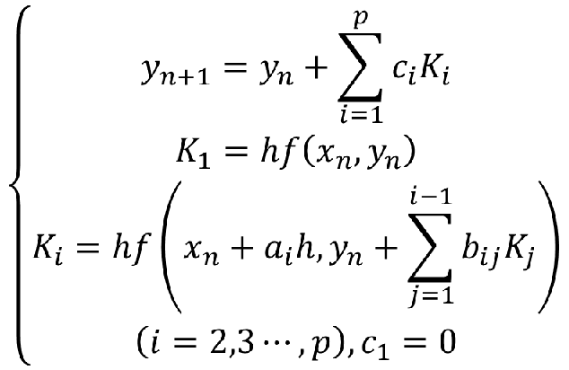

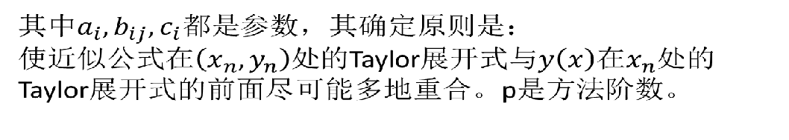

*（此公式不用记）*

### 4.3.2 二阶龙格-库塔法

一阶龙格-库塔法即为欧拉公式


其无穷多组解对应的R-K公式统称二阶方法

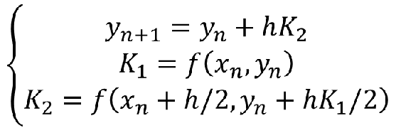

在计算两次函数值的情况下，局部截断误差最高为*O(h^3^)*

### 4.3.3 三阶龙格-库塔法

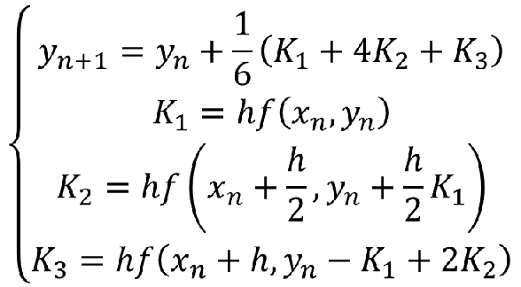

### 4.3.4 四阶龙格-库塔法

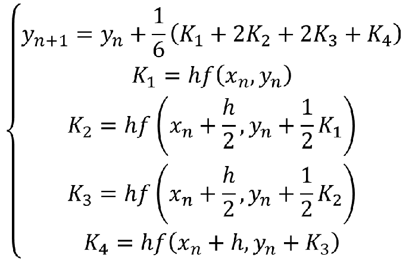

### 4.3.5 说明

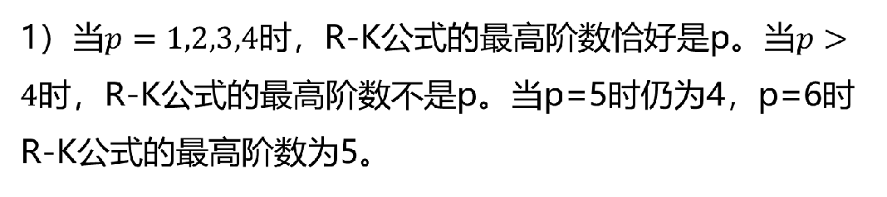

2）R-K方法的导出基于Taylor展开，故要求所求问题的解具有较高的光滑度。

当解充分光滑时，四阶R-K方法确实优于改进Euler法。对一般实际问题，四阶R-K方法一般可达到精度要求。

如果本来实际解的光滑性差，则用四阶R-K方法解的效果不如改进Euler法。

## 4.4各方法讨论，合适步长的确定

### 4.4.1 精度问题

欧拉法（一阶精度O(h^2^)）<改进欧拉法（二阶精度）<四阶龙格-库塔法（四阶精度）

### 4.4.2收敛性与稳定性

收敛性问题

稳定性问题

绝对稳定性

## 4.5 一阶联立方程组与高阶方程

### 一阶微分方程组

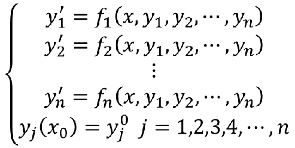

以四阶龙格-库塔法为例，公式为：

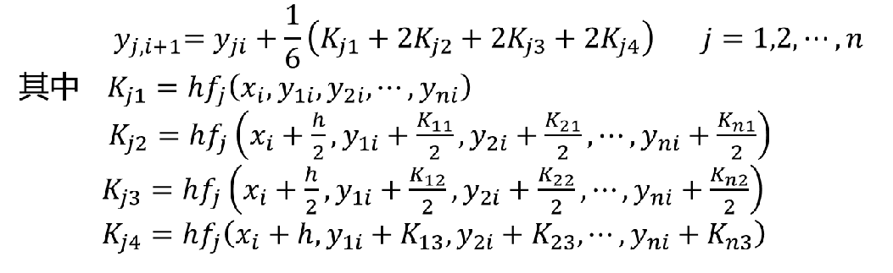

### 高阶微分方程

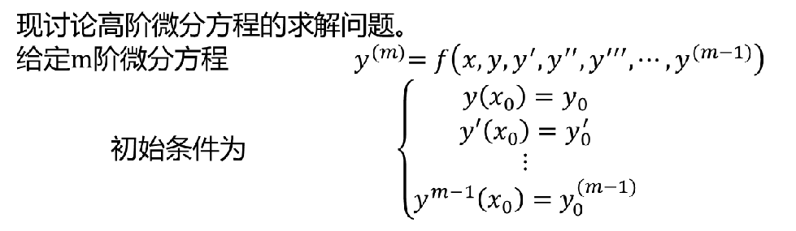

可以通过变量代换将高阶常微分方程初值问题转化为一阶常微分方程组初值题

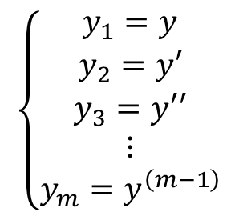

将问题转换为一阶联立方程组：

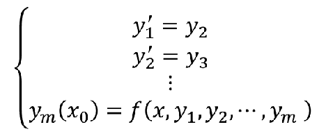

初始条件变为：


## 4.6 边值问题

将边值问题转换为初值问题

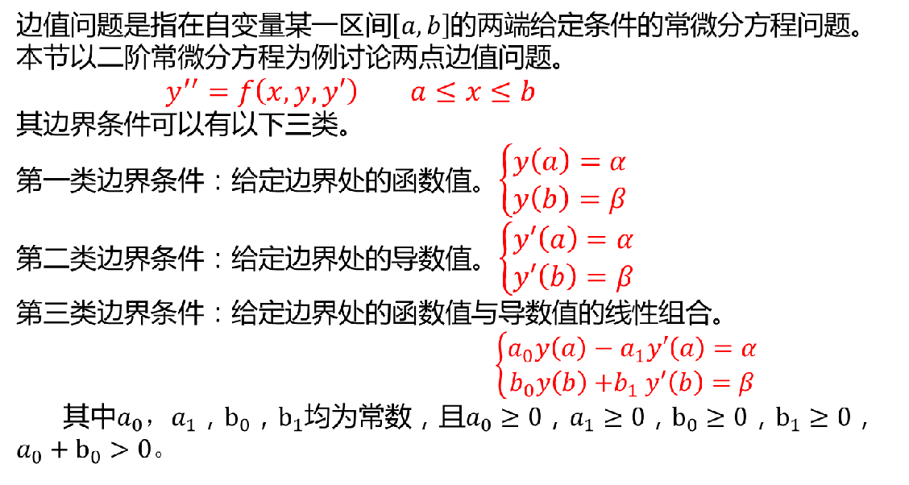

两类求解方法：

- 将边值问题转换为同解的初值问题求解，如打靶法（重点）
- 将边值问题离散化为线性方程组求解，如有限差分法（简单介绍）

### 4.6.1 打靶法（重点要求）

### 4.6.2 有限差分解法（不做要求）


### 数据处理与数据分析的主要内容

- 插值法

  - 拉格朗日插值
  - 牛顿插值

- 最小二乘法曲线拟合

插值节点、插值函数的概念

拉格朗日插值多项式

差商的基本性质

牛顿插值法

等距节点插值

